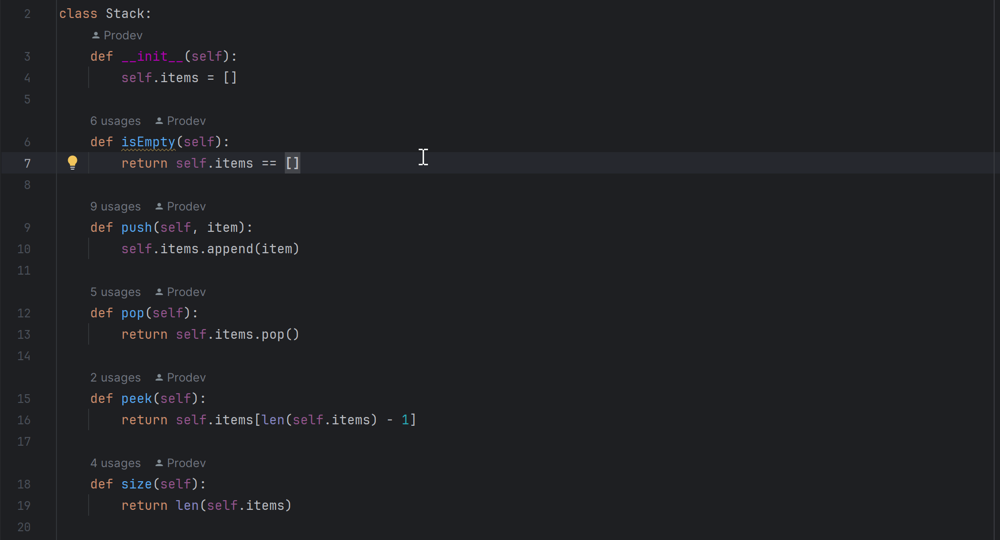
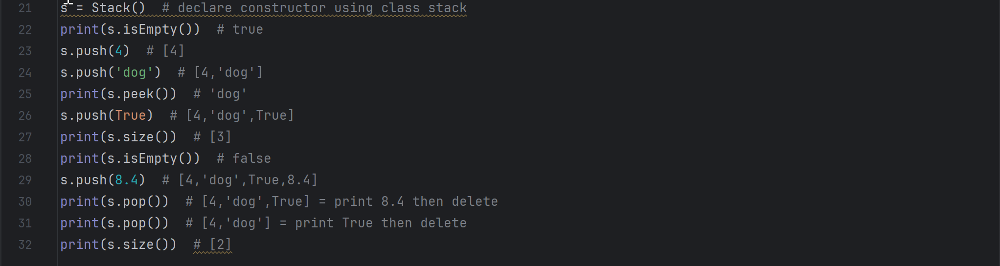

# *Bracket Check With Stack Algorithm*
This project is an example of using a Stack Algorithm to check the correct matching of brackets { }, [ ], and ( ) in a given string.

### *Objective*

This project was created to:

1. Check the correctness of matching parentheses in a string.
2. Report an error if the bracket matching is incorrect.
3. Report the location of the error if there is an error.

### *Description*

This section explains how the code works.

#### *First (What is Stack Algorithm?)*

A Stack Algorithm is an algorithm that uses a data structure called a "stack", which behaves similarly to placing pillows or boards on top of each other. The principle is "Last In, First Out" (LIFO), which means that data added to the stack most recently is retrieved before data added to the previous stack. this

The operation of an algorithm stack has many interactions. I will walk you through the basic steps:

Stack Creation: We need to create a stack data structure. Most of them use lists. (or arrays in other languages) to store data inside the stack. and set the pointer for the stack (for example, the default value is -1 or 0).

Adding data to the stack (Push): When we want to add any data to the stack, we add it to the list. (or array) and increment the pointer value where this pointer points to the last data added to the stack.

Pulling data from the stack (Pop): When we want to pull data from the stack. We will use the value of the pointer to point to the most recent data that was added to the stack. and we will remove that information from the list. (or array) and lower the pointer value.

Empty Check: We can check whether the stack is empty or not by checking the value of the stack pointer. If the pointer value is -1 (or 0), the stack is empty.

Peek: We can view the most recent item in the stack by using the value of a pointer to point to the item in the list (or array) without deleting the item.

This is the sample code.

And this is result

#### *Second (How does Bracket Check work?)*

Now that you understand how Stack Algorithms work, let's get started.

1. is_error is used to store information about whether the verification has an error or not, and location is used to store the location where the error occurred, if any.

2. Loop every character in the string "str" using "for i in range(len(str))", storing them in the variable "s".

3. For each character, the code checks the correctness of the parentheses:
    - If the variable "s" is {, [ or (), push() the variable "s" onto the stack using "stack.push(s)" to preserve the open parentheses.

    - If the variable "s" is }, ] or ) the code checks if the stack is not empty (not empty means there is an open parenthesis) and pops the characters on the stack using stack.pop(. ) and store in variable "p".

    - If the stack is empty, meaning there is no opening parenthesis paired with the closing parenthesis, "is_error" will be True.

    - After that, the code checks that "p" and "s" are matched correctly. This means if "p" is { and "s" is } or "p" is [ and "s" is ] or "p" is ( and "s" is ) in this case no action is taken, but if No, "is_error" will be True and the location "i" where the error occurred will be added to "location".

4. After the loop finishes, the code checks if the stack is empty. If it is not empty, it means that there are open parentheses that are not closed in the string. "is_error" will be True and the last position will be added to "location".

5. Finally, the function returns "is_error" and "location" to report the verification result. "is_error" will be True if there is a parenthesis matching error, and "location" will store the location of the error (if any) in a list.
